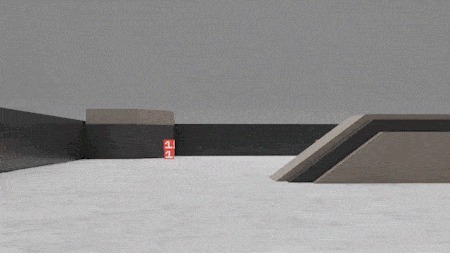

# Sim2Real 课程比赛指南

The RoboMaster EP chassis

The RMUS playground

## 预备知识

### Linux

http://www.ee.surrey.ac.uk/Teaching/Unix/

### Docker 容器

什么是 Docker 

安装 Docker 环境

Docker容器

Docker镜像

Docker Registry

### ROS

http://wiki.ros.org/ROS/Tutorials#Core_ROS_Tutorials

## 系统架构

比赛系统由三部分组成：

* 比赛平台（Frontend Platform）
* 仿真运行环境（Simulation）
* 真实运行环境（Real）

Client/Server架构

Habitat-Simulator+Habitat-Lab

接口

## 比赛项目

The RoboMaster University Sim2Real Challenge (`Sim2Real`) at its core allows participants to win points by
rearranging mineral using fully automated RoboMaster EPs that have been modified officially. 

The match lasts for five minutes with a sim2real-based format, where robots rearrange minerals based on the information shown on the exchange tags to earn points. Participants will be ranked according to their total points won. 

The objective of the challenge is to assess how well a program completed on a simulation platform can be operated in real application environments. 

Teams are required to develop and debug their algorithms in a simulator and submit their codes by the specified deadline. The official staff will deploy corresponding codes in physical robots of the same models to earrange minerals. 

Compared to other RoboMaster University events, this challenge does not require teams to build physical robots, allowing participants to focus entirely on algorithm design.

## 运行指南

登录 Docker registry

准备 Docker 环境

仿真环境

开发环境

## ROS 接口

以 ROS Topics 形式给出

## Other resource

- The [ICRA2022 RoboMaster University Sim2Real Challenge (RMUS)](https://air.tsinghua.edu.cn/robomaster/sim2real_icra22.html)
  - [the RMUS rulebook](https://air.tsinghua.edu.cn/robomaster/RMUS2022_rules_manual.pdf)
  - [FAQ List](https://air.tsinghua.edu.cn/robomaster/FAQ_List.pdf) [CN](https://air.tsinghua.edu.cn/robomaster/FAQ_List_Chinese.pdf)
  - [the Vision Markers on the Cube](https://dl.djicdn.com/downloads/robomaster-s1/20190620/RoboMaster_S1_Vision_Markers_44pcs_15_15cm_updated.pdf)

## Reference

1. [ROS-X-Habitat: Bridging the ROS Ecosystem with Embodied AI](https://arxiv.org/abs/2109.07703)
   - https://github.com/ericchen321/ros_x_habitat
2. https://nvidia.github.io/nvidia-docker/
3. [How to Train Your [Dragon] Embodied Agent (with AI Habitat)](https://aihabitat.org/tutorial/2020/)
4. https://github.com/facebookresearch/habitat-lab
5. https://github.com/ros/dynamic_reconfigure

