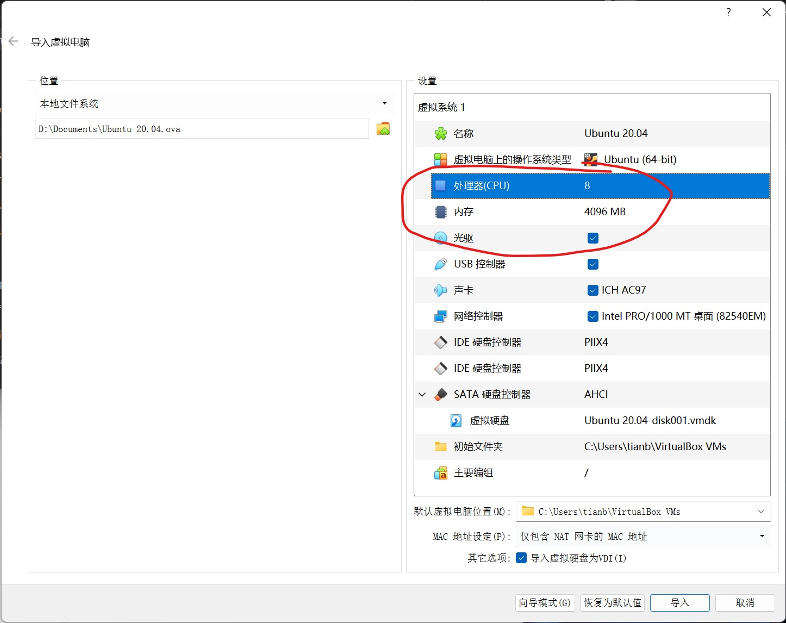

# 配置Docker运行环境

## 安装Docker环境 - Windows系统

Window环境下，需要先安装虚拟机：

1. [下载 Ubuntu 20.04 虚拟机文件](https://cloud.tsinghua.edu.cn/f/1a0b5af2cc574eae89e2/)
2. [下载 VirtualBox](https://cloud.tsinghua.edu.cn/f/80c66d74aee749b69be4/)并安装
   
3. 点击管理 - 导入虚拟电脑
   
4. 在弹出窗口中选择虚拟机文件
   
5. 根据实际计算机配置调整虚拟机处理器 / 内存配置，修改虚拟机保存路径
   
6. 导入完成后如图所示
   
7. 点击Ubuntu 20.04启动虚拟机，登录
   * 虚拟机用户名为`ubuntu`，密码为`ubuntu`
   * 进入系统后，可以单击右上角 - Settings - Displays - Resolution 修改屏幕大小
   
8. 按照下一节准备Ubuntu虚拟机中的Docker环境

## 安装Docker环境 - Ubuntu 系统

创建文件 `install.sh`：

```shell
#!/bin/bash
set -x 
set -e

apt-get update

apt-get -y install \
    ca-certificates \
    curl \
    gnupg \
    lsb-release

curl -fsSL https://download.docker.com/linux/ubuntu/gpg | gpg --dearmor -o /usr/share/keyrings/docker-archive-keyring.gpg
echo \
  "deb [arch=$(dpkg --print-architecture) signed-by=/usr/share/keyrings/docker-archive-keyring.gpg] https://download.docker.com/linux/ubuntu \
  $(lsb_release -cs) stable" | tee /etc/apt/sources.list.d/docker.list > /dev/null
apt-get update
apt-get install -y docker-ce docker-ce-cli containerd.io

systemctl restart docker
```

执行以下命令：

```shell
chmod +x install.sh
sudo ./install.sh
sudo usermod -aG docker $USER
```

执行完成后，注销后重新登录即可使用 Docker 容器。执行以下命令检验安装：

```shell
docker ps
```

正确的运行结果应为

```
CONTAINER ID    IMAGE    COMMAND    CREATED    STATUS    PORTS
```

