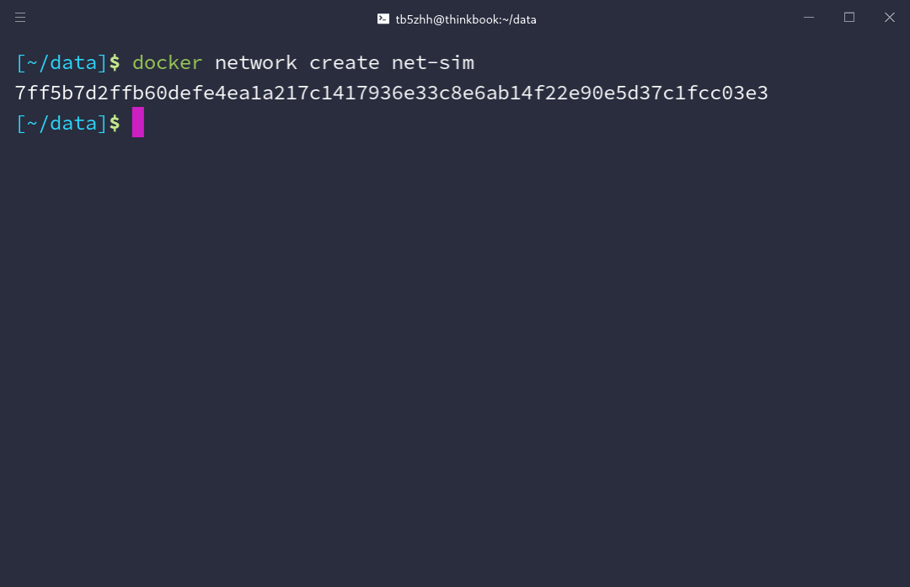
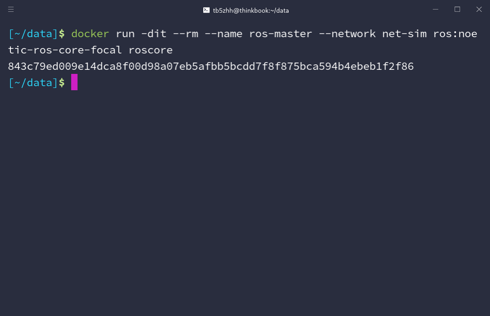
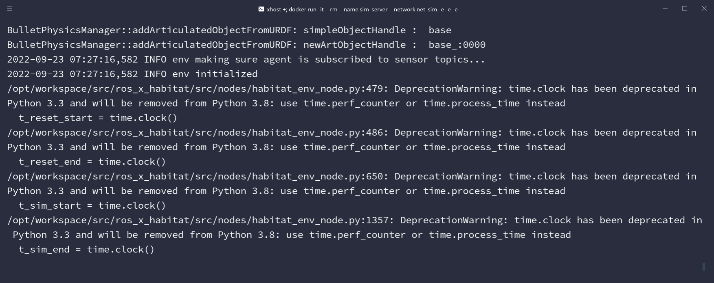
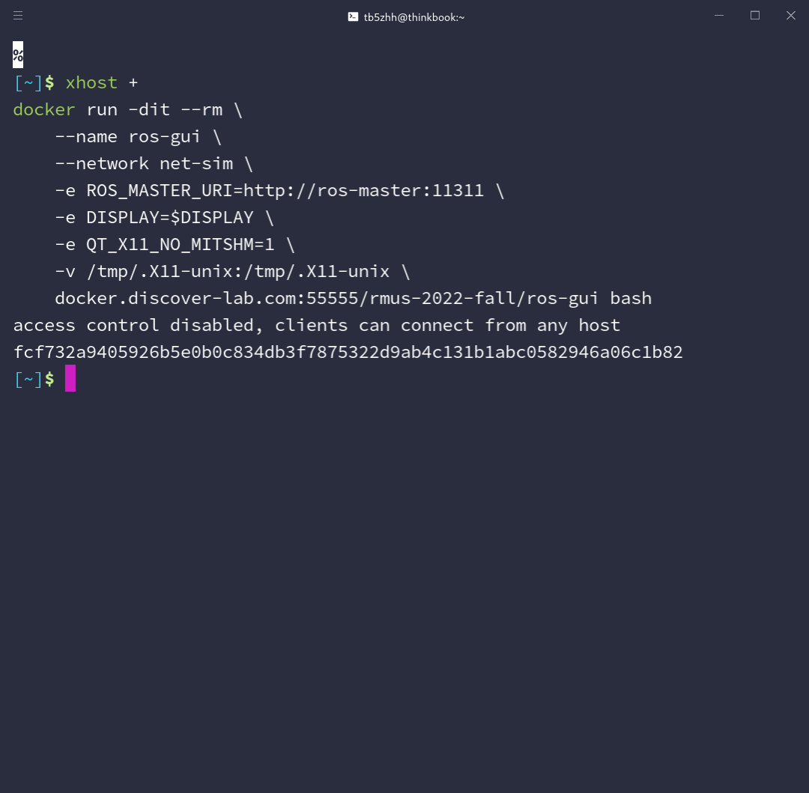
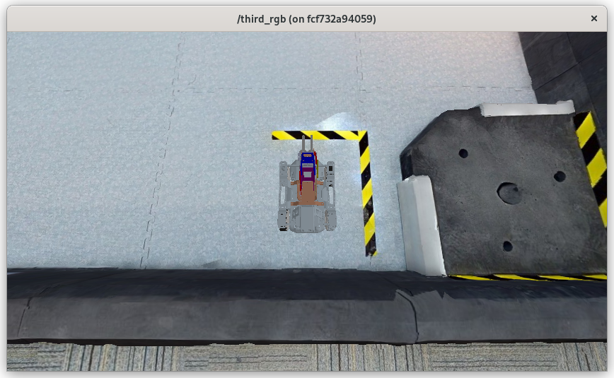
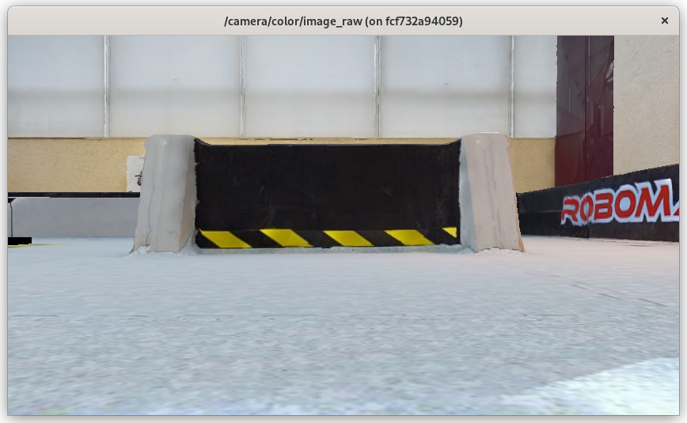
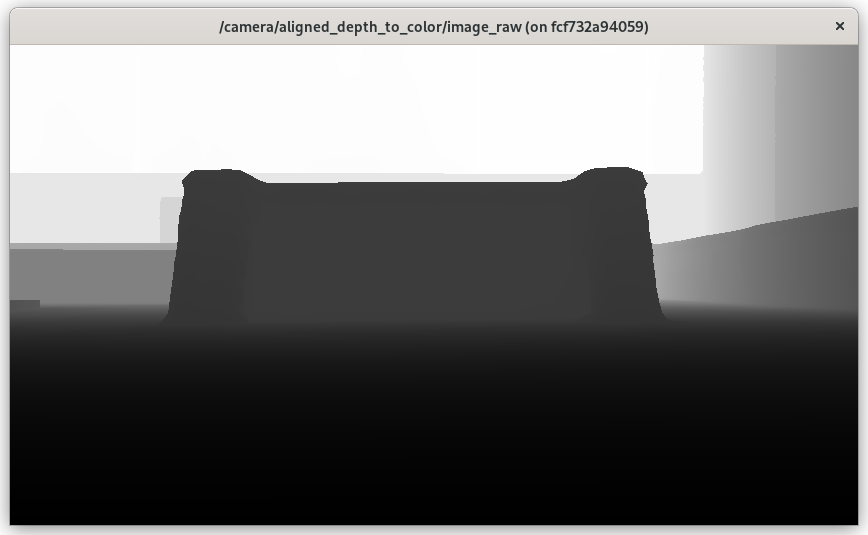

# 启动仿真环境

本节讲述启动仿真环境的步骤，在此之前需要先[获取Docker镜像](./prepare-images.md)。

## 创建虚拟网卡

执行以下命令创建通讯节点、服务端、客户端之间相互通信的网络环境：

```shell
docker network create net-sim
```

该命令为后台命令，执行后会**马上结束**，输出如下图（具体的字符串可能不同）：



## 启动通讯节点

执行以下指令启动通讯节点：

```shell
docker run -dit --rm --name ros-master --network net-sim ros:noetic-ros-core-focal roscore
```

该命令为后台命令，执行后会**马上结束**，输出如下图（具体的字符串可能不同）：



## 启动仿真环境

CPU版本：

```shell
xhost +
docker run -it --rm \
	--name sim-server \
    --network net-sim \
	-e ROS_MASTER_URI=http://ros-master:11311 \
    -e DISPLAY=$DISPLAY \
    -e QT_X11_NO_MITSHM=1 \
    -e NO_AT_BRIDGE=1 \
    -e LIBGL_ALWAYS_SOFTWARE=1 \
    -v /tmp/.X11-unix:/tmp/.X11-unix \
	docker.discover-lab.com:55555/rmus-2022-fall/sim-headless-cpu
```

GPU版本：

```shell
xhost +
docker run -it --rm \
	--name sim-server \
    --network net-sim \
	-e ROS_MASTER_URI=http://ros-master:11311 \
    -e DISPLAY=$DISPLAY \
    -e QT_X11_NO_MITSHM=1 \
    -e NO_AT_BRIDGE=1 \
    -e LIBGL_ALWAYS_SOFTWARE=1 \
    -v /tmp/.X11-unix:/tmp/.X11-unix \
    --gpus all \
	docker.discover-lab.com:55555/rmus-2022-fall/sim-headless
```

该命令为**前台命令**，执行后会开始初始化仿真环境，当出现以下结果时初始化完成，可以执行后续步骤：



## 相机输出可视化

执行以下命令启动可视化容器：

```shell
xhost +
docker run -dit --rm \
    --name ros-gui \
    --network net-sim \
    -e ROS_MASTER_URI=http://ros-master:11311 \
    -e DISPLAY=$DISPLAY \
    -e QT_X11_NO_MITSHM=1 \
    -v /tmp/.X11-unix:/tmp/.X11-unix \
    docker.discover-lab.com:55555/rmus-2022-fall/ros-gui bash
```

该命令为后台命令，执行后会**马上结束**，输出如下图（具体的字符串可能不同）：



测试容器启动后，执行以下命令进行可视化：

```shell
# 第三人称视角小车全貌
docker exec -dit ros-gui /opt/ros/noetic/env.sh rosrun image_view image_view image:=/third_rgb
# 小车RGB相机输出
docker exec -dit ros-gui /opt/ros/noetic/env.sh rosrun image_view image_view image:=/camera/color/image_raw
# 小车深度相机输出
docker exec -dit ros-gui /opt/ros/noetic/env.sh rosrun image_view image_view image:=/camera/aligned_depth_to_color/image_raw
```

执行后，会依次出现以下可视化界面（窗口大小可调整）：







## 停止仿真环境

停止创建的容器即可。**注意，此处容器在停止后将会立即删除，任何对容器的修改将不会被保存。**

```shell
docker stop sim-server
docker stop ros-gui
docker stop ros-master
docker network rm net-sim
```

如需再次启动仿真环境，按照[此处](#2)说明重新执行操作即可。