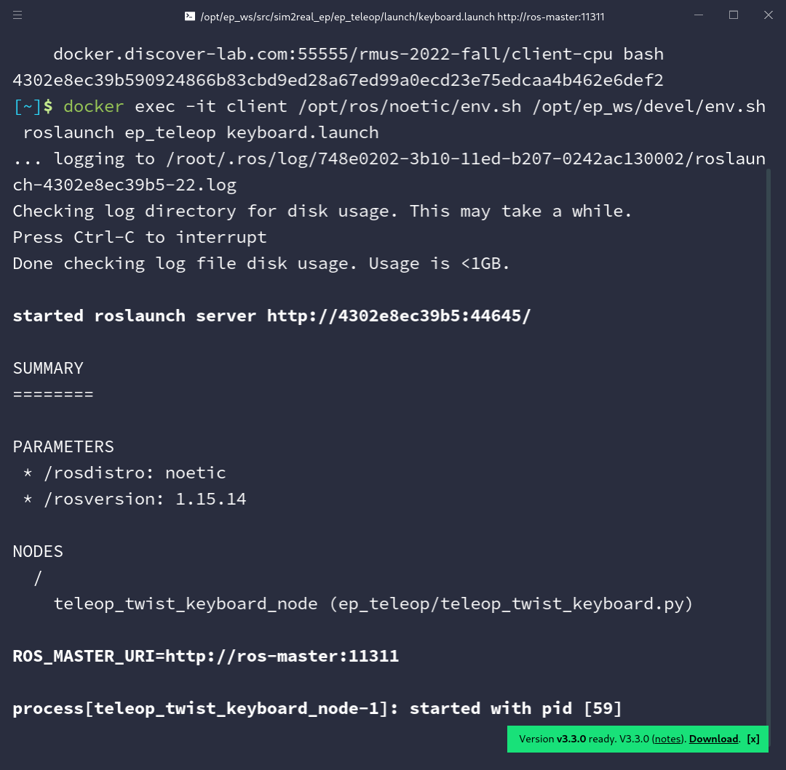

# 启动仿真EP

本节讲述启动仿真EP小车的步骤，在此之前需要先[获取Docker镜像](./prepare-images.md)并[启动仿真环境](./start-sim-env.md)。


## 启动仿真EP

推荐先按照 2.1 节说明将仿真环境中的相机可视化，便于观察小车移动。

通过以下命令在后台启动客户端：

```shell
docker run -dit --rm --network net-sim --name client \
	--cpus=5.6 -m 8192M \
	-e DISPLAY=$DISPLAY \
	-e QT_X11_NO_MITSHM=1 \
    -e ROS_MASTER_URI=http://ros-master:11311 \
    -v /tmp/.X11-unix:/tmp/.X11-unix \
    docker.discover-lab.com:55555/rmus-2022-fall/client-cpu bash
```

该命令为后台命令，执行后会**马上结束**，输出如下图（具体的字符串可能不同）：


## 使用键盘控制小车移动

客户端启动后，执行以下命令启动键盘监听：

```shell
docker exec -it client /opt/ros/noetic/env.sh /opt/ep_ws/devel/env.sh roslaunch ep_teleop keyboard.launch
```

该命令为前台命令，输出如下图时，可以通过键盘操控小车移动：



具体操作说明如下：

* 按 `i` ，`j` ，`,` ，`l` 分别控制小车前进、后退、旋转
* 按 `I` ，`J` ，`<` ，`L` 控制小车水平方向移动
* 按 `k` 停止小车移动
* 按 `1` 放下小车机械臂
* 按 `2` 抬起小车机械臂
* 按 `3` 关闭抓爪
* 按 `4` 打开抓爪
* 按 `Ctrl + C` （Windows）/ `Control + C` （Mac）停止监听
