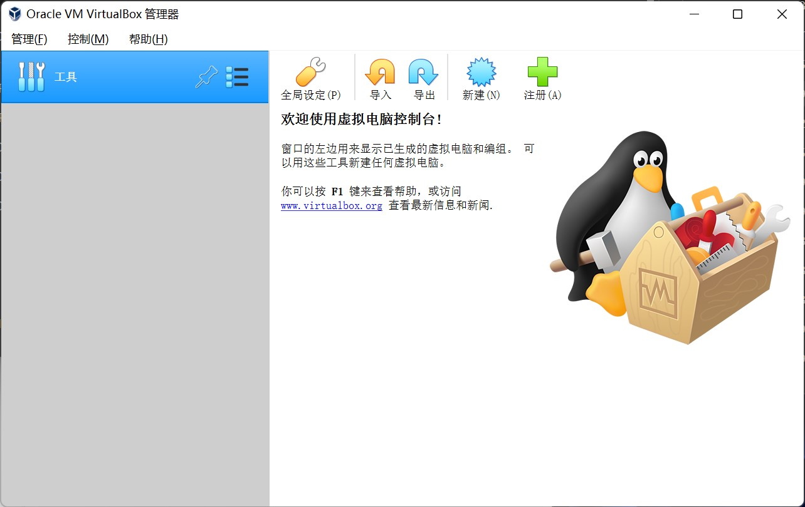
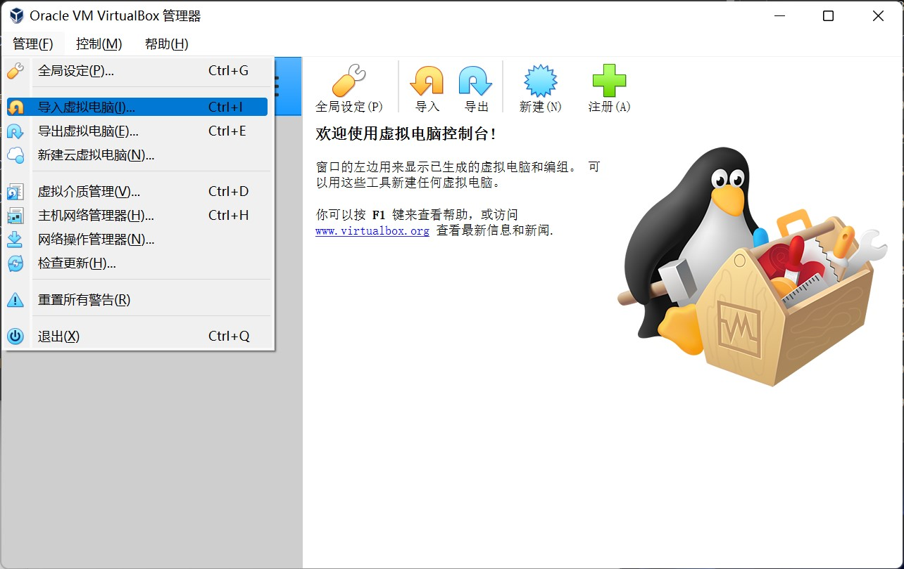
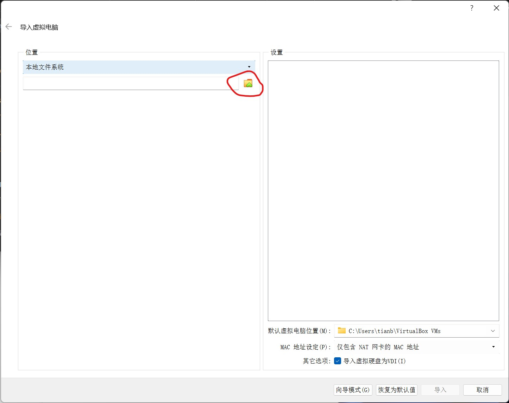
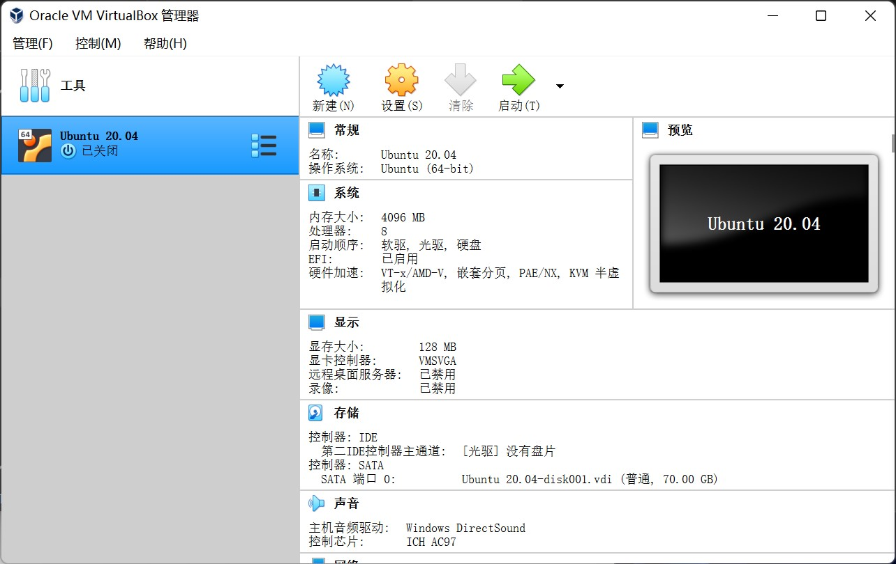
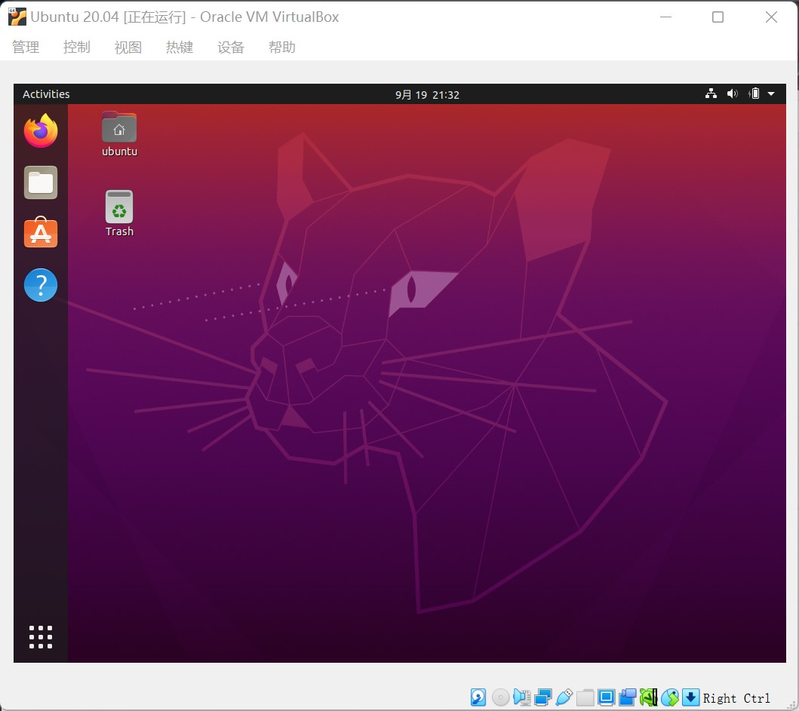

# 准备Ubuntu虚拟机

这一节讲述如何在Windows环境下准备Ubuntu虚拟机。

请使用Windows系统的同学依照此节内容配置，使用Linux系统（Ubuntu）的同学请跳过本节进入[下一节](./install-docker.md)安装Docker。

---

Window环境下，需要先安装虚拟机：

1. [下载 Ubuntu 20.04 虚拟机文件](https://cloud.tsinghua.edu.cn/f/1a0b5af2cc574eae89e2/)
2. [下载 VirtualBox](https://cloud.tsinghua.edu.cn/f/80c66d74aee749b69be4/)并安装
   
3. 点击管理 - 导入虚拟电脑
   
4. 在弹出窗口中选择虚拟机文件
   
5. 根据实际计算机配置调整虚拟机处理器 / 内存配置，修改虚拟机保存路径
   
6. 导入完成后如图所示
   
7. 点击Ubuntu 20.04启动虚拟机，登录
       * 虚拟机用户名为`ubuntu`，密码为`ubuntu`
       * 进入系统后，可以单击右上角 - Settings - Displays - Resolution 修改屏幕大小
       
8. 按照下一节准备Ubuntu虚拟机中的Docker环境