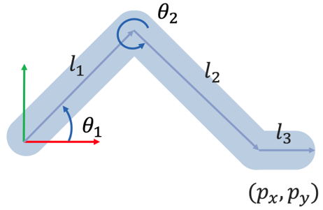
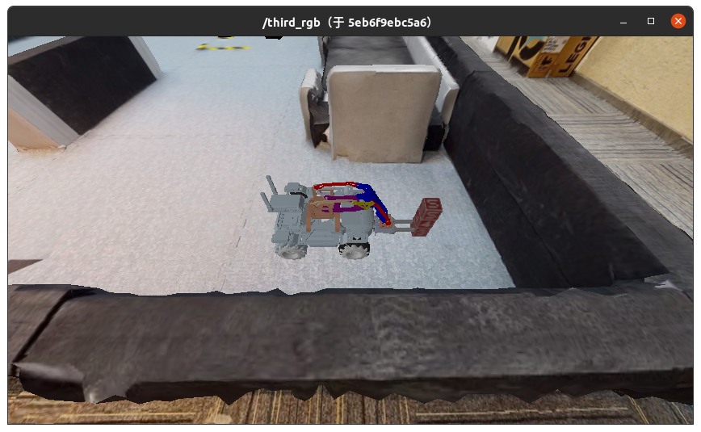
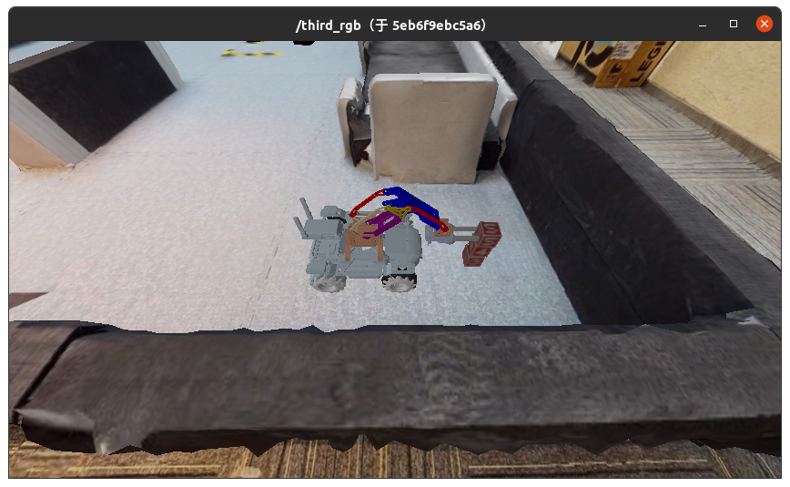

# 作业1 - 逆向运动学

**在下列教程中，请将 `[Student ID]` 替换为自己的学号。**

## 这次作业的目标是什么？



本次作业中，需要根据机械臂末端夹爪的位姿，解出机械臂的两个关节角度，也就是实现机械臂的逆运动学。

此问题数学描述如上图所示，已知连杆长度 $l1$ ， $l2$ ， $l3$ 以及机械臂末端位置 $(p_x, p_y)$ ，求两个关节的角度 $\theta_1, \theta_2$ 。

为了让这个纯数学问题有实际的应用场景，我们构造了一个可以和仿真环境交互的**控制节点**，使得当小车与一个**标有5的物块**足够近时，无论小车如何前后移动，关节夹角能够根据物块和小车的相对距离进行调整，机械臂前端夹爪与物块保持在同一位置。

我们已经完成了这个控制节点的整体架构以及和仿真环境的交互接口，同学们只需要完成**根据相对位置解算关节角**的这一部分即可。

具体而言，同学们只需要补充 `course_ws/src/me_arm/script/reverse.py` 文件中的实现即可完成作业：

```python
def inverse_kinematics(self, cube_pose, ep_pose):
    joint_pos = [0, 0]
    
    # [TODO] Implement inverse kinematics

    return joint_pos
```

其中，传入的`cube_pose`和`ep_pose`均为长度为3的浮点数数组，表示物块和小车在世界坐标系下的坐标。同学们需要根据二者的相对位置解算出上图中的两个关节角度（弧度），并以数组的方式返回。

注意，世界坐标系的方向[如图所示](https://air-discover.github.io/Intelligent-Systems-2022Fall/EP/#3-environment)。实验过程中，保证小车机械臂与物块在同一条直线上。

## 我要怎样完成这次作业？

### 克隆作业仓库

将作业仓库克隆至本地：

```
git clone https://git.tsinghua.edu.cn/intelligent-system-2022fall/hw1.git
```

或

```
git clone https://github.com/AIR-DISCOVER/IS2022Fall-hw1.git
```

### 补充实现 

补充 `course_ws/src/me_arm/script/reverse.py` 文件中的实现。

标注有 `[TODO]`的部分是需要你实现的。 

### 将项目编译为镜像

在 `IS2022Fall-hw1` 目录下，执行以下命令将项目编译为Docker镜像。

```
docker build . -t docker.discover-lab.com:55555/[Student ID]/client:hw1 
```

## 如何检验我的实现是否正确？

> 首先启动仿真环境，并将相机可视化

### 启动仿真容器

注意，在本次作业中，仿真环境的 tag 为 **hw1**。

在**新的终端**中执行以下命令启动仿真环境：

```shell
docker network create net-sim
docker run -dit --rm --name ros-master --network net-sim ros:noetic-ros-core-focal roscore
docker run -it --rm --name sim-server --network net-sim -e ROS_MASTER_URI="http://ros-master:11311" --gpus all docker.discover-lab.com:55555/rmus-2022-fall/sim-headless:hw1
```

### 可视化相机输出

在**新的终端**执行以下命令启动可视化：

```shell
xhost +
docker run -dit --rm --name ros-gui --network net-sim -e ROS_MASTER_URI=http://ros-master:11311 -e DISPLAY=$DISPLAY -e QT_X11_NO_MITSHM=1 -v /tmp/.X11-unix:/tmp/.X11-unix docker.discover-lab.com:55555/rmus-2022-fall/ros-gui bash
docker exec -dit ros-gui /opt/ros/noetic/env.sh rosrun image_view image_view image:=/third_rgb
```

### 创建控制容器

根据[上一节](#23)编译得到的镜像创建<u>控制容器</u>并执行：

在**新的终端**执行以下命令启动作业容器：

```shell
docker run -it --rm -e ROS_MASTER_URI="http://ros-master:11311" --network net-sim --name hw1 docker.discover-lab.com:55555/[Student ID]/client:hw1
```

### 检查实现的正确性

下面的命令会初始化场景，随机生成1/2/3层木块（最顶层木块一定为木块5），并将小车放在距离木块较近的***<u>随机位置</u>***。

```shell
docker exec -it ros-master /opt/ros/noetic/env.sh rostopic pub -1 /reset geometry_msgs/Point "x: 0.0
y: 0.0
z: 0.0"
```

多次执行上述命令初始化，或者按照[这里](https://air-discover.github.io/Intelligent-Systems-2022Fall/how-to/start-sim-ep/#2)的方式控制小车前后移动，如果实现正确可以观察到小车的夹爪始终放在**最上层的木块5所在的位置**。


### 停止运行中的容器

```shell
docker network rm net-sim
docker stop hw1
docker stop sim-server
docker stop ros-master
```

## 如何提交我的作业？

如果你确认你的实现正确，你可以通过以下命令将你的控制容器镜像推送到课程Docker平台。

我们的评测系统会自动运行你的容器并打分。    

```shell
docker login docker.discover-lab.com:55555
# Input your Student ID and password
# The default password is [Student ID]ABCdef
# You can change it later in https://docker.discover-lab.com:55555
docker push docker.discover-lab.com:55555/[Student ID]/client:hw1
```

## 另：前向运动学

在控制节点中，我们也已经实现了前向运动学，各位同学可以参考以下步骤复现：

### 启动仿真容器

同[3.1节](#启动仿真容器)

### 可视化相机输出

同[3.2节](#可视化相机输出)

### 创建控制容器

根据[上一节](#23)编译得到的镜像创建<u>控制容器</u>并执行：

在**新的终端**执行以下命令启动作业容器：**（注意与上面不同）**

```shell
docker run -it --rm -e ROS_MASTER_URI="http://ros-master:11311" --network net-sim --name hw1 docker.discover-lab.com:55555/[Student ID]/client:hw1 /opt/course_ws/devel/env.sh rosrun MeArm forward.py
```

### 初始化场景

下面的命令会初始化场景，随机生成1/2/3层木块（最顶层木块一定为木块5），并将小车放在距离木块较近的***<u>随机位置</u>***。

```shell
docker exec -it ros-master /opt/ros/noetic/env.sh rostopic pub -1 /reset geometry_msgs/Point "x: 0.0
y: 0.0
z: 0.0"
```

多次执行上述命令初始化，直到初始化为**包含三层木块**的场景。

### 传入关节角度并观察

执行下面的命令，传入关节角度后小车夹爪会放在1层木块处：

```shell
docker exec -it ros-master /opt/ros/noetic/env.sh rostopic pub -1 /joint_states_hw1 sensor_msgs/JointState "header:
  seq: 0
  stamp: {secs: 0, nsecs: 0}
  frame_id: ''
name: ['']
position: [0.16247, 5.1739]
velocity: [0]
effort: [0]"
```



执行下面的命令，传入关节角度后小车夹爪会放在2层木块处：

```shell
docker exec -it ros-master /opt/ros/noetic/env.sh rostopic pub -1 /joint_states_hw1 sensor_msgs/JointState "header:
  seq: 0
  stamp: {secs: 0, nsecs: 0}
  frame_id: ''
name: ['']
position: [0.50608, 4.97364]
velocity: [0]
effort: [0]"
```


执行下面的命令，传入关节角度后小车夹爪会放在3层木块处：

```shell
docker exec -it ros-master /opt/ros/noetic/env.sh rostopic pub -1 /joint_states_hw1 sensor_msgs/JointState "header:
  seq: 0
  stamp: {secs: 0, nsecs: 0}
  frame_id: ''
name: ['']
position: [0.77649, 4.95607]
velocity: [0]
effort: [0]"
```



### 停止运行中的容器

```shell
docker network rm net-sim
docker stop hw1
docker stop sim-server
docker stop ros-master
```
