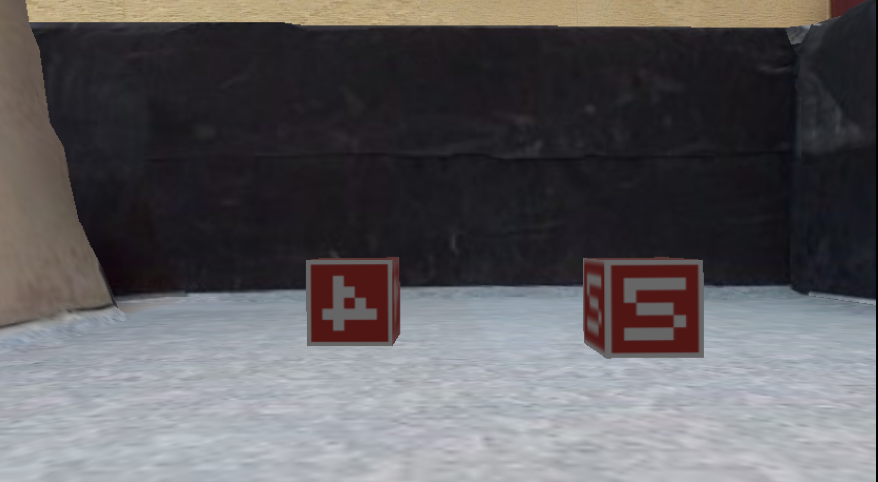
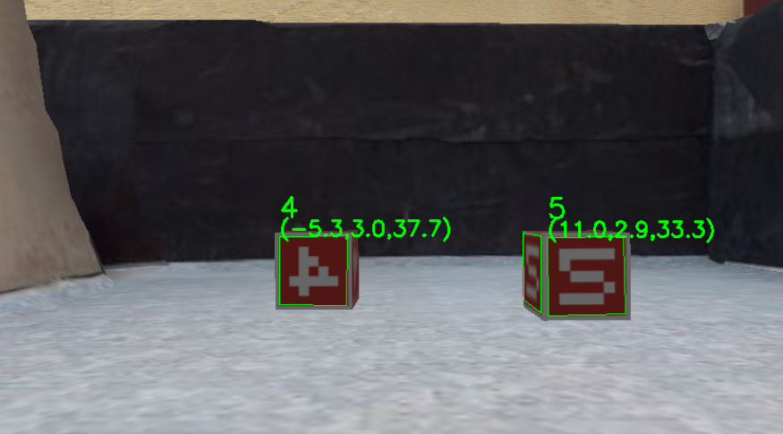
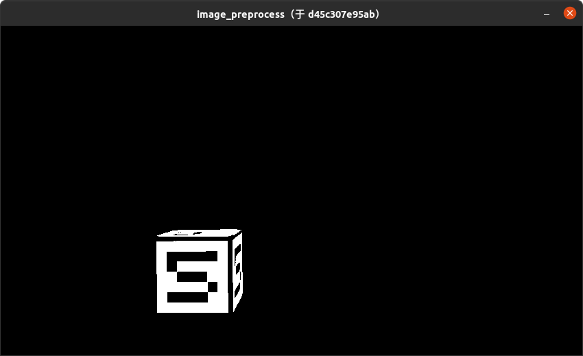
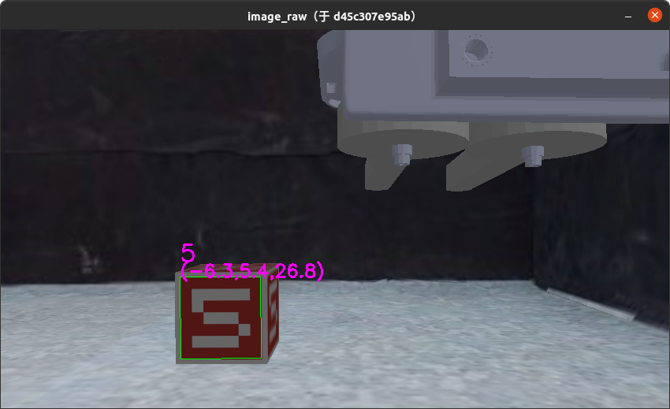

# 作业2 - 数字定位与识别

**在下列教程中，请将 `[Student ID]` （包括括号）替换为自己的学号。**

## 这次作业的目标是什么？

本次作业的目标是根据第一人称视角相机拍摄得到的图像（下图1），找到图中包含的物块相对小车的位姿，并给出物块上所写的数字（下图2）。





本次作业中实验框架已经搭建完成，实验过程分为三步：

1. 处理输入图像，生成一张相同尺寸的掩码图，掩码图中物块部分为255，其他部分为0
2. 根据掩码图以及相机内参矩阵，找到物块面顶点在图像上的坐标，以及其变换矩阵
3. 根据找到的物块面对数字进行分类

其中第三步已经给出完整实现，同学们不需要在作业中完成（但是仍然推荐阅读给出的实现）；第一步和第二步分别对应`course_ws/src/marker_location/scripts/img_processor.py`文件中的`Processor.preprocess`与`Processor.detect_square`函数，同学们在此次作业中需要实现这两个函数。

```python
def preprocess(self, frame):
    """Preprocess the image captured by the camera, so that pixels that belong to cubes have the value of 255 while the counterparts have the value of 0

    Args:
        frame (numpy.ndarray): Captured image in RGB channels

    Returns:
        numpy.ndarray: The mask of cubes. Numpy array of the same shape as frame
    """
    image_bool = frame

    ############# TODO ##############
        
    #################################

    return image_bool
```

```python
def detect_square(self, image_bool, camera_matrix):
    """Find the quad containing numbers within given frames, along with their poses in the environment

    Args:
        image_bool (numpy.ndarray): The mask of cubes provided by preprocess function
        camera_matrix (numpy.ndarray): The intrinsic matrix of the camera, 3x3

    Returns:
        (q, t, r):
        - q: quad position on the image
        - t: quad translation vectors
        - r: quad rotation vectors
    """

    quads_prj, tvec_list, rvec_list = None, None, None

    ############# TODO ##############
        
    #################################

    return quads_prj, tvec_list, rvec_list
```

## 我要怎样完成这次作业？

### 克隆作业仓库

将作业仓库克隆至本地：

```
git clone https://gitee.com/tb5zhh/is2022-fall-hw2.git
```

或

```
git clone https://github.com/AIR-DISCOVER/IS2022Fall-hw2.git
```

### 补充实现 

补充 `course_ws/src/marker_location/scripts/img_processor.py` 文件中的实现。

标注有 `[TODO]`的部分是需要完成的，你需要实现：

1. `Processor.preprocess`: 传入参数为 `numpy.ndarray` 格式的相机输出图像（尺寸为 `HxWx3` ）；需要返回尺寸为 `HxWx1` 的 `numpy.ndarray` 格式的掩码图，其中物块所在的像素需赋值为255，其他区域需赋值为0.
2. `Processor.detect_square`: 传入参数为 `numpy.ndarray` 格式的掩码图（ `preprocess` 函数的输出）以及尺寸为 `3x3` 的相机内参矩阵；需要找到图片中的所有的物块表面，并返回 a. 这些表面的顶点在图像上的像素坐标 b. 从相机到物块表面的位移向量 c. 从相机到物块表面的旋转向量。具体参数与返回值的定义与说明详见代码注释。

### 将项目编译为镜像

在 `IS2022Fall-hw2` 目录下，执行以下命令将项目编译为Docker镜像。

```
docker build . -t docker.discover-lab.com:55555/[Student ID]/client:hw2 --network host
```

## 如何检验我的实现是否正确？

### 启动仿真容器

注意，在本次作业中，仿真环境的 tag 为 **hw2**。

在**新的终端**中执行以下命令启动仿真环境（CPU）：

```shell
docker pull docker.discover-lab.com:55555/rmus-2022-fall/sim-headless-cpu:hw2
docker network create net-sim
docker run -dit --rm --name ros-master --network net-sim ros:noetic-ros-core-focal roscore
docker run -it --rm --name sim-server --network net-sim \
    -e ROS_MASTER_URI="http://ros-master:11311" \
    -e DISPLAY=$DISPLAY \
    -e QT_X11_NO_MITSHM=1 \
    -e LIBGL_ALWAYS_SOFTWARE=1 \
    -v /tmp/.X11-unix:/tmp/.X11-unix \
    docker.discover-lab.com:55555/rmus-2022-fall/sim-headless-cpu:hw2
```

在**新的终端**中执行以下命令启动仿真环境（GPU）：

```shell
docker pull docker.discover-lab.com:55555/rmus-2022-fall/sim-headless:hw2
docker network create net-sim
docker run -dit --rm --name ros-master --network net-sim ros:noetic-ros-core-focal roscore
docker run -it --rm --name sim-server --network net-sim \
    -e ROS_MASTER_URI="http://ros-master:11311" \
    --gpus all \
    docker.discover-lab.com:55555/rmus-2022-fall/sim-headless:hw2
```

### 创建控制容器

根据[上一节](#将项目编译为镜像)编译得到的镜像创建<u>控制容器</u>并执行：

在**新的终端**执行以下命令启动作业容器：

```shell
xhost +
docker run -it --rm --network net-sim --name hw2 \
    -e DISPLAY=$DISPLAY \
    -e QT_X11_NO_MITSHM=1 \
    -e ROS_MASTER_URI=http://ros-master:11311 \
    -v /tmp/.X11-unix:/tmp/.X11-unix \
    docker.discover-lab.com:55555/[Student ID]/client:hw2
```

执行该命令后，会出现两个可视化界面：

1. 第一个界面展示 `Processor.preprocess` 函数返回的掩码图（黑白）。该函数正确实现后，可视化界面应如下图所示：
   
2. 第二个界面将 `Processor.detect_square` 函数返回的数字所在物块平面信息，以标注的形式附加在第一人称视角相机的画面上。该函数正确实现后，可视化界面应如下图所示：
   

### 检查实现的正确性

按照[这里](https://air-discover.github.io/Intelligent-Systems-2022Fall/how-to/start-sim-ep/#2)的方式控制小车移动，可以在可视化窗口2中发现，标注框始终与物块面重合：


### 停止运行中的容器

```shell
docker network rm net-sim
docker stop hw2
docker stop sim-server
docker stop ros-master
```

## 如何提交我的作业？

如果你确认你的实现正确，你可以通过以下命令将你的控制容器镜像推送到课程Docker平台。

我们的评测系统会自动运行你的容器并打分。    

```shell
docker login docker.discover-lab.com:55555
# Input your Student ID and password
# The default password is [Student ID]ABCdef
# You can change it later in https://docker.discover-lab.com:55555
docker push docker.discover-lab.com:55555/[Student ID]/client:hw2
```