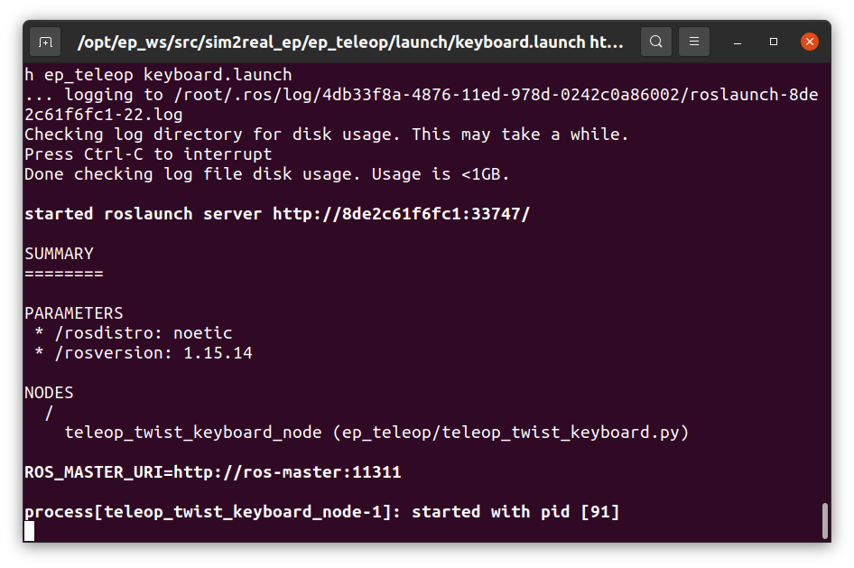
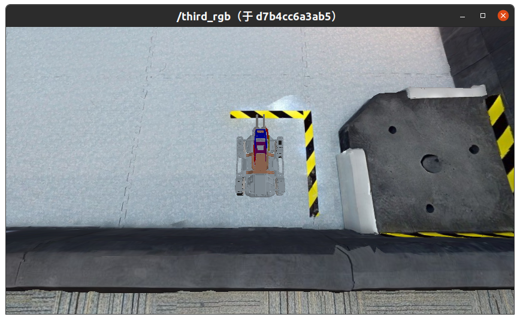
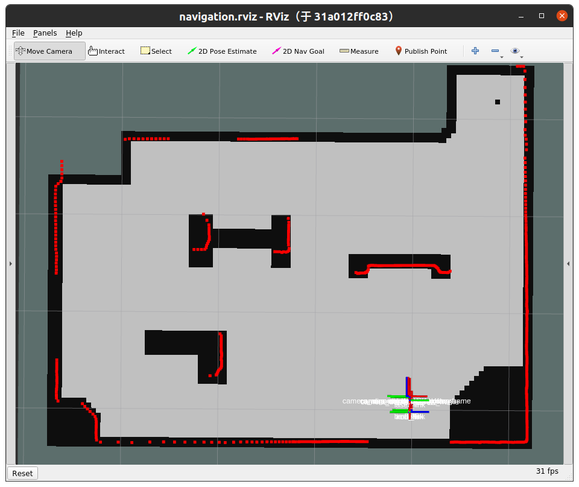
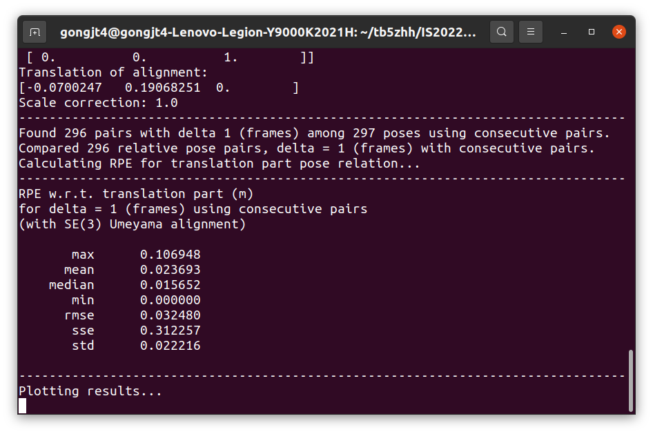
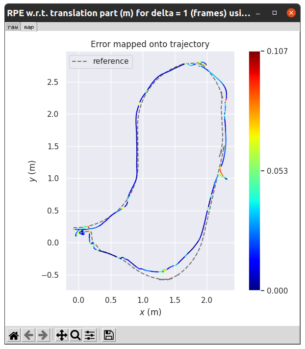

# 作业3 - 基于 Cartographer 的小车定位

**在本次作业中，请将 `launch.sh` 中的 `ID=test` 改为 `ID=[Student ID]` ，其中 `[Student ID]` 为自己的学号。**

## 这次作业的目标是什么？

本次作业的任务是 EP 小车在环境中的定位，通过 [Cartographer](https://github.com/cartographer-project/cartographer) 工具实现。

Cartographer 是一个进行**实时定位与重建（SLAM）**的算法，在本次作业中我们只需用到其中的定位部分。

## 我要怎样完成这次作业？

### 克隆作业仓库

将作业仓库克隆至本地：

```
git clone https://gitee.com/tb5zhh/is2022-fall-hw3.git
```

或

```
git clone https://github.com/AIR-DISCOVER/IS2022Fall-hw3.git
```

### 修改参数

修改 `cartographer_navigation/param/cartographer_2d_localization.lua` 中的参数配置。


## 如何检验我的实现是否正确？

### 准备环境

在 `IS2022Fall-hw3` 目录下，执行以下命令：

```shell
./launch.sh
```

等待命令执行，出现以下界面时，表明已经完成编译控制节点、启动仿真环境、启动可视化、启动控制节点、启动键盘控制：



同时在此界面中，键盘输入可以控制小车移动，具体操作说明如[这里](https://air-discover.github.io/Intelligent-Systems-2022Fall/how-to/start-sim-ep/#2)所示。

此外，进行到上述状态后会出现两个可视化界面。第一个可视化界面是小车的第三人称视角相机输出：



第二个可视化界面是 `cartographer` 的可视化界面：



### 录制路径并比较结果

在 `IS2022Fall-hw3` 目录下，执行以下命令：

```shell
./record.sh
```

执行此命令后，小车移动的轨迹将被记录30秒，这一段时间内可以在上一节的键盘监听窗口中控制小车移动。记录完成后将会调用工具对定位过程的准确性进行评价，并以量化误差和可视化的方式输出。

你需要修改 `cartographer_navigation/param/cartographer_2d_localization.lua` 中的参数配置，使得量化误差尽可能地小。我们已经在工程中提供了这个文件，但是你需要通过修改这个文件进一步提高定位性能、降低量化误差。

量化误差的样例如下：



轨迹的可视化比较的样例如下：




### 停止运行中的容器

```shell
./halt.sh
```

## 如何提交我的作业？

如果你确认你的实现正确，你可以通过以下命令将你的控制容器镜像推送到课程Docker平台。

```shell
docker login docker.discover-lab.com:55555
docker push docker.discover-lab.com:55555/[Student ID]/client:hw3
```

**注意，在本次作业中，你至少需要运行过一次 `./launch.sh` （即至少编译过一次控制容器），才能完成作业的提交。**

我们的评测系统会自动运行你的容器并打分。    