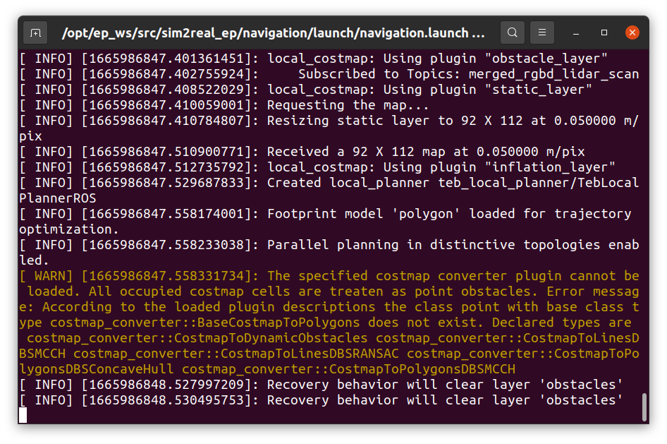
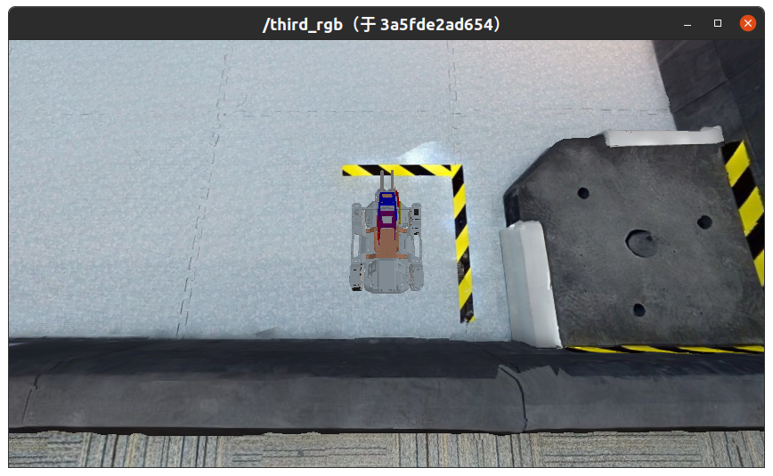
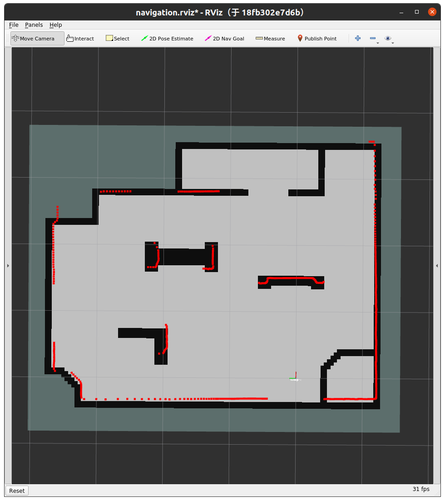
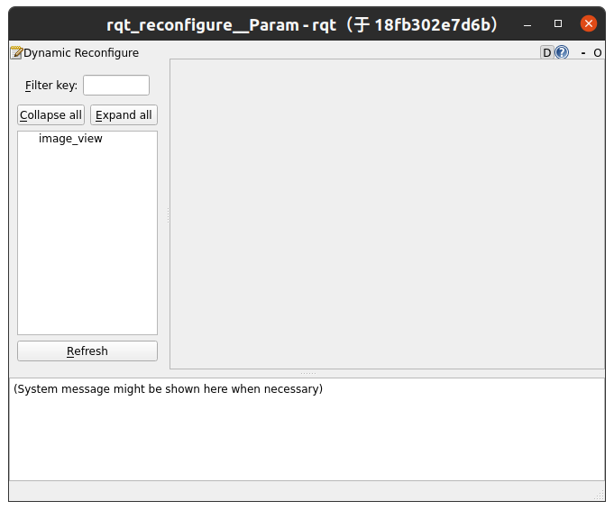
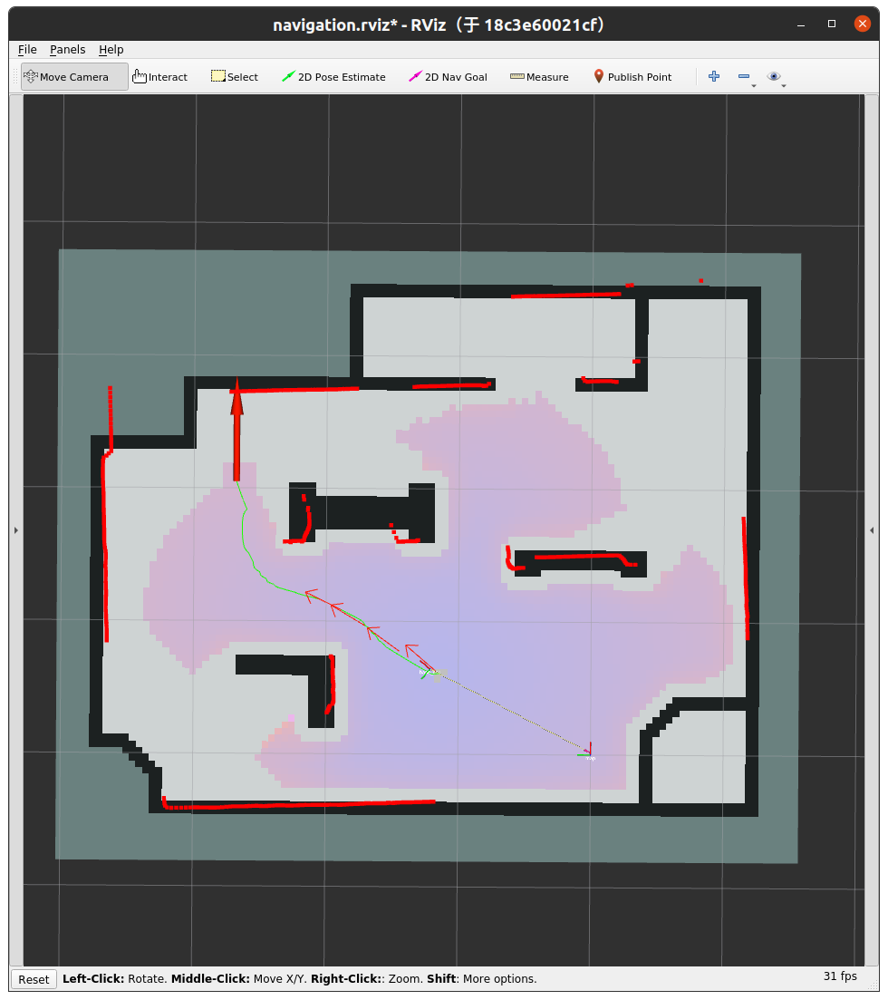

# 作业4 - 小车导航

**在本次作业中，请将 `launch.sh` 中的 `ID=test` 改为 `ID=[Student ID]` ，其中 `[Student ID]` 为自己的学号。**

## 这次作业的目标是什么？

本次作业的任务是：给定仿真环境中目标点的坐标，将 EP 小车导航至该目标点。

导航过程分为两步：

1. 全局路径点规划：本次作业中采用 `ros-noetic-global-planner` 包实现，其作用是根据 EP 小车当前位置和目标位置，在地图上选取多个短期规划目标（即路径点）
2. 局部路径点跟踪：本次作业中由助教实现。其作用是获取最近未到达的路径点，输出小车地盘速度和角度，将 EP 小车驱动至该路径点。

本次作业中需要大家调整全局规划和局部跟踪两个步骤中的参数，使得小车从起点出发到达目标点的时间尽可能短。

## 我要怎样完成这次作业？

### 克隆作业仓库

将作业仓库克隆至本地：

```
git clone --recursive https://gitee.com/tb5zhh/is2022-fall-hw4.git
```

或

```
git clone --recursive https://github.com/AIR-DISCOVER/IS2022Fall-hw4.git
```

或[点击这里](https://cloud.tsinghua.edu.cn/f/b06174c685a048838565/)下载压缩包。

### 修改参数

修改 `cartographer_navigation/param/cartographer_2d_localization.lua` 中的参数配置。


## 如何检验我的实现是否正确？

### 准备环境

在 `IS2022Fall-hw4` 目录下，执行以下命令（请将 `launch.sh` 中的 `ID=test` 改为 `ID=[Student ID]` ，其中 `[Student ID]` 为自己的学号）：

```shell
./launch.sh
```

等待命令执行，出现以下界面时，表明已经完成编译控制节点、启动仿真环境、启动可视化、启动控制节点，导航功能开始运行：




于此同时，启动完成时会出现两个可视化界面和一个参数调整面板。第一个可视化界面是小车的第三人称视角相机输出：



第二个可视化界面是 `cartographer` 的可视化界面：



参数调整面板如下所示：



### 选择目标点，开始导航

在 `IS2022Fall-hw4` 目录下，执行以下命令：

```shell
./set_goal.sh [x] [y]
```

其中 `x` ， `y` 是目标点的坐标；不提供两个参数时，会导航至默认目标点 $(2.05, 2.68)$ 。执行此命令后，可视化界面2上会出现全局规划生成的路径点（如下所示），同时小车开始逐步向最近未达到路径点前进。



### 调整参数

全局规划部分参数位于 `navigation/param/global_costmap_params.yaml` 中，主要需要修改以下参数：
* `inflation_radius`: 障碍物在地图中向外扩展的膨胀区的半径。这个值越大，规划出的路径会越靠近通道中央，但是过大会导致路径无法生成。
* `cost_scaling_factor`: 膨胀过程中应用到代价的比例因子。成本函数的计算方法如下：
$$
\exp(-k * (D - r))
$$
  其中$k$为比例因子，这个值与越大代价越小。$D$ 和 $r$ 分别是小车到目标点距离和小车外接圆半径。

实际运行过程中，也可以通过参数调整面板实时地调整参数，但是最终提交作业时需要将选定的参数在 `navigation/param/global_costmap_params.yaml` 中修改后编译提交。

---

局部跟踪部分参数位于 `navigation/scripts/tracker.py` 中 20 - 25 行，共有五个参数：

```bash
/navigation/dis_angle_k   # 角度追踪增益，数值越大给出越大的角速度指令
/navigation/dis_disx_k    # x方向追踪增益，数值越大给出越大的x方向线速度指令（相对世界坐标系）
/navigation/dis_disy_k    # y方向追踪增益，数值越大给出越大的y方向线速度指令（相对世界坐标系）
/navigation/pre_point     # 追踪点与当前点之间间隔点的个数，即前馈点间隔
/navigation/window_size   # 查找最近点时搜索区间的长度
```

实际运行过程中，也可以通过以下命令实时调整参数，但是提交作业时需要将选定的参数在 `navigation/scripts/tracker.py` 中修改后编译提交。

```bash
./shell.sh rosparam set <参数的名字> <设定值>
# 例如：
# rosparam set /navigation/dis_disx_k 5.0
```

追踪算法参考pure pursuit算法，参数的含义请参考课件中纯追踪算法部分。


### 停止运行中的容器

```shell
./halt.sh
```

## 如何提交我的作业？

如果你确认你的实现正确，你可以通过以下命令将你的控制容器镜像推送到课程Docker平台。

```shell
docker login docker.discover-lab.com:55555
docker push docker.discover-lab.com:55555/[Student ID]/client:hw4
```

**注意，在本次作业中，你至少需要运行过一次 `./launch.sh` （即至少编译过一次控制容器），才能完成作业的提交。**

我们的评测系统会自动运行你的容器并打分。    
