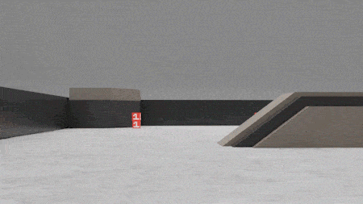

# 智能系统设计与实践 2022秋

最后更新日期：2022.09.11

更新说明请见[这里](UPDATES.md)。

FAQ 列表请见[这里](FAQ.md)。

---

* [课程简介](#课程简介)
   * [课程安排](#课程安排)
* [课程实验](#课程实验)
   * [实验框架](#实验框架)
   * [操作说明](#操作说明)
   * [比赛项目](#比赛项目)
* [其他资源](#其他资源)

## 课程简介

[TODO] 

本课程从智能系统的各单元模块介绍出发，配合真实系统设计与实践环节，全方位培养学生对智能系统的理解与认识。

### 课程安排

本课程总计32课时。

|课程|形式|内容|课程|形式|内容|
|:-:|:-:|:-:|:-:|:-:|:-:|
|1|授课|课程基本信息|13-14|实验|竞赛详细介绍与参考案例|
|2|授课|智能系统组成  智能系统发展与回顾|15-18|实验|机械装机、3D打印、抓取机构实验|
|3-4|授课|系统设计流程与工具|19-22|实验|仿真软件实验|
|5-6|授课|移动底盘、机械臂操作|23-26|实验|现实环境测试、仿真到现实迁移|
|7-8|授课|相机标定与立体视觉、目标检测与识别|27-30|竞赛|初赛、决赛与颁奖|
|9-10|授课|SLAM与多传感器融合|31-32|展示|参赛队总结汇报|
|11-12|授课|轨迹规划与控制||||

> 我能收获什么？

1. 运用机电、信息技术等多学科知识，进行初步的**智能系统设计**
2. 完整体验智能系统的**开发与调试**过程，掌握相关的**方法论**
3. 在竞赛环节针对**开放性挑战**提出创造性解决方案
4. 完成**课程设计**报告与展示，有效地进行观点的提炼与表达

> 我需要哪些预备知识？

* Linux 基础概念与操作：[基础教程（English）](http://www.ee.surrey.ac.uk/Teaching/Unix/) [进阶教程（中文）](https://missing-semester-cn.github.io/2020/course-shell/)
  * 如何对Linux系统中的文件进行操作？
  * 什么是环境变量？如何修改环境变量？
  * 如何通过SSH登录远程环境？
* ROS 基础概念与操作：[教程](https://wiki.ros.org/ROS/Tutorials#Core_ROS_Tutorials)
  * 什么是ROS Topics？如何获取ROS Topics广播的内容？
  * 什么是ROS Nodes？
* Docker 基础操作：[基础教程](https://www.ruanyifeng.com/blog/2018/02/docker-tutorial.html) [进阶教程](https://yeasy.gitbook.io/docker_practice/image/pull)
  *  什么是镜像、容器？如何基于镜像创建容器？
  * 如何从服务器端拉取镜像？如何将镜像推送到服务器？
  * 如何将容器外的文件传输/映射到容器内？如何保存对容器的修改？

## 课程实验

### 实验框架

[TODO]

### 操作说明

[如何在本地准备仿真环境](HOW-TO-SIM.md)

### 比赛项目

尚未公布，请持续关注！

> **RMUS 2022 比赛项目：**
>
> 
>
> The RoboMaster University Sim2Real Challenge (`Sim2Real`) at its core allows participants to win points by
> rearranging mineral using fully automated RoboMaster EPs that have been modified officially. 
>
> The match lasts for five minutes with a sim2real-based format, where robots rearrange minerals based on the information shown on the exchange tags to earn points. Participants will be ranked according to their total points won. 
>
> 
>
> The objective of the challenge is to assess how well a program completed on a simulation platform can be operated in real application environments. 
>
> Teams are required to develop and debug their algorithms in a simulator and submit their codes by the specified deadline. The official staff will deploy corresponding codes in physical robots of the same models to earrange minerals. 
>
> Compared to other RoboMaster University events, this challenge does not require teams to build physical robots, allowing participants to focus entirely on algorithm design.
>

## 其他资源

此处提供一些额外的资源供感兴趣的同学参考。注意，不阅读此节内容**不影响**课程学习与实验。

* ICRA2022 RoboMaster University Sim2Real Challenge 相关材料
  * [首页](https://air.tsinghua.edu.cn/robomaster/sim2real_icra22.html)
  * [规则手册](https://air.tsinghua.edu.cn/robomaster/RMUS2022_rules_manual.pdf)
  * [方块贴纸图样](https://dl.djicdn.com/downloads/robomaster-s1/20190620/RoboMaster_S1_Vision_Markers_44pcs_15_15cm_updated.pdf)

* AI Habitat 教程
  * [How to Train Your [Dragon] Embodied Agent - ECCV 2020 Tutorial](https://aihabitat.org/tutorial/2020/)

* ROS-X-Habitat: 连接ROS与AI Habitat仿真环境的接口
  * [论文链接](https://arxiv.org/abs/2109.07703)
  * [项目首页](https://github.com/ericchen321/ros_x_habitat)
